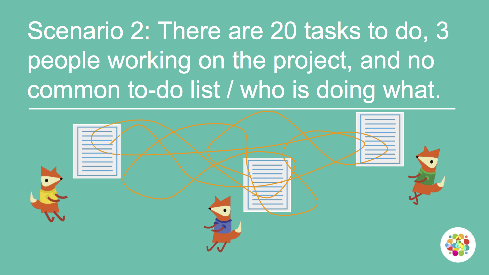
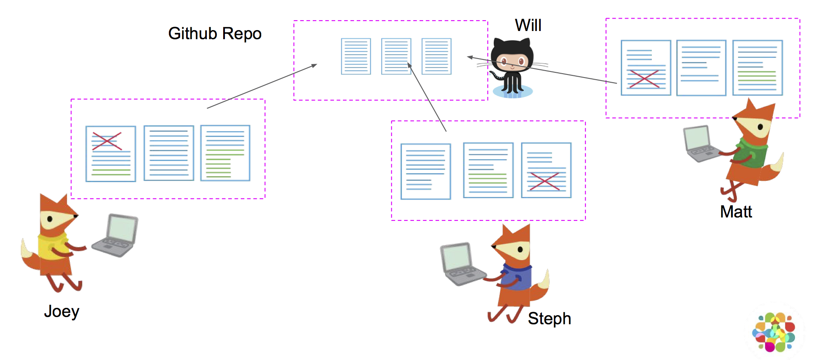
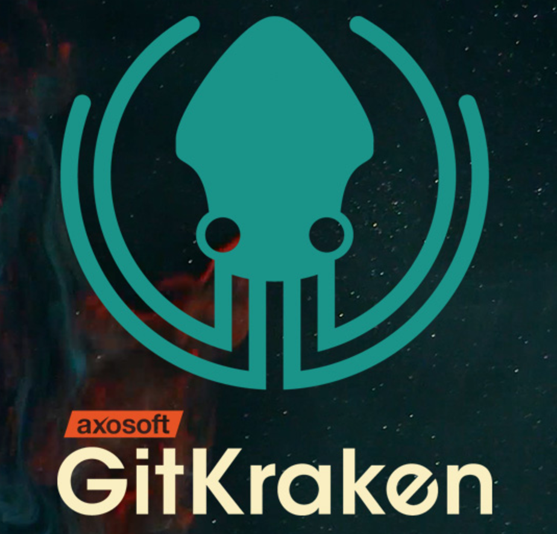

# Intro: What is version control and working open?

[[Table of Contents]](index) - [[NEXT: Let's get started with GitHub>>]](practicalexercises/github/git-01-lets-get-started-with-github)

  Hands up - _who has heard of version control software?_  
  _What do you think it does?_

 

## What is Version control? 

The **management of changes** to documents, computer programs, large web sites, and other collections of information.

**Examples:**
- Numbering of book editions
- Wikipedia's Page history

 

### Where did it come from?

> The need for a logical way to organize and control revisions has existed for almost as long as writing has existed,  but revision control became much more important, and complicated when the era of computing began

#### Elements of a Version Control system

- Changes are usually identified by a number or letter code, termed the "revision number"

- Each revision is associated with a timestamp and the person making the change. 
- Only changes to a file are recorded rather than saving a whole new copy.

- Revisions can be compared, restored, and with some types of files, merged.

 

---

## What is git?

Open source (free to use) Version control software. Usually accessed via the command line, or a client program.

### Where did it come from?

Git development began in 2006 after many developers of the Linux kernel gave up access to [BitKeeper](http://www.bitkeeper.org/) (at the time the best but proprietary)

Linus Torvalds on the name **`git`**: 

> "I'm an egotistical bastard, and I name all my projects after myself. First 'Linux', now 'git'

<small>More on the name in the source code original [readme](https://github.com/git/git/tree/e83c5163316f89bfbde7d9ab23ca2e25604af290) file</small>

 

---

## Why use it in research? 

### Exhibit A

### Exhibit B

 

---

## What is GitHub

A **website** that allows you to **store your Git repositories online** and makes it easy to collaborate with others. They also provide other services like issue (bug) tracking and wikis. Similar services are [GitLab](https://gitlab.com) and [BitBucket](https://bitbucket.org/).

### Why use it in research:

 

- Acts as a remote back-up
- Facilitates transparency
- Facilitates project management
- Facilitates sharing and collaboration
- Super-charges innovation by Open Sourcing Science
  + [Mozilla & Working Open](https://www.youtube.com/watch?v=quKdaqlR_9w)
  + [Open Source Basics](https://www.youtube.com/watch?v=Tyd0FO0tko8)
  + [Reinventing Discovery](https://www.amazon.co.uk/Reinventing-Discovery-New-Networked-Science/dp/0691160198/ref=sr_1_1?ie=UTF8&qid=1544031907&sr=8-1&keywords=reinventing+discovery)
  + [Macroecological and macroevolutionary patterns emerge in the universe of GNU/Linux operating systems](https://onlinelibrary.wiley.com/doi/10.1111/ecog.03424)

## Anatomy of GitHub Repo

- **Readme files**. Create a `README.md` file to explain what your project is, and how to install and use it. `README.md` is the file that is automatically displayed when you open a GitHub repo.

- **License**. Without some sort of licence, the contents of the repository are technically closed. Some allow users of the code to do anything they like with their code - these are known as permissive licences. Examples are the [MIT Licence](https://tldrlegal.com/license/mit-license) or [Apache](https://tldrlegal.com/license/apache-license-2.0-(apache-2.0)).
    + [https://choosealicense.com/](https://choosealicense.com/) - does what it says on the tin and helps you choose a licence. Here are some resources to help you choose:
    + [https://tldrlegal.com/](https://tldrlegal.com/) - plain english explanations of licences in bullet form.
    
- **Contributing guide** - make a file called CONTRIBUTING.md and guidelines for contributors so they know what they should do if they want to help you out.

- **Code of Conduct** - good projects have codes of conduct to make sure that people are treated well. Github has an [Code of Conduct wizard](https://help.github.com/articles/adding-a-code-of-conduct-to-your-project/) to make it easy to add one.

- **Issues** - use GitHub issues to record and discuss tasks.

(This list was largely inspired by Mozilla's open leadership 101.)

### Example repositories

- [An rOpenSci Labs package: `dataspice`](https://github.com/ropenscilabs/dataspice)
- [A research compendium shared on GitHub: _Ecology Letters review paper: Noise-driven phenomena in population biology_](https://github.com/cboettig/noise-phenomena)

 

---

## What is GitKraken

**GitKraken:** A client for working with Git that uploads your work to GitHub. Another is [SourceTree](https://www.sourcetreeapp.com/), and there's a [big list of clients on the git website](https://git-scm.com/download/gui/windows).

 

---

## Recap: git, GitHub, & GitKraken

git allows you to effectively "save" your work at important points in time and come back to any of the save points.
 
Sharing our work on GitHub allows others to inspect our work, make copies and contribute back changes. 

GitKraken allows you to work with both from a single graphical user interface.

Git, GitKraken, and Github are three separate things. Git is the system used for version control, but you don't have to use it with GitHub or GitKraken.

### Always remember

[[Table of Contents]](index) - [[NEXT: Let's get started with GitHub>>]](practicalexercises/github/git-01-lets-get-started-with-github)
