# Let's get started with Git and GitHub through GitKraken

[[<<PREVIOUS: What is version control]](../../02-what-is-version-control) -
[[Table of Contents]](../../index) - [[NEXT: Cloning and collaborating: contributing changes>>]](git-03-cloning-and-collaborating)

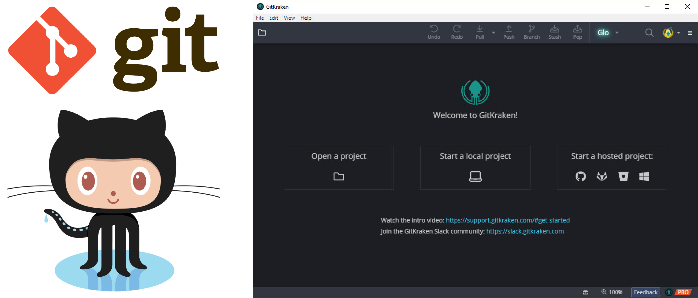

We'll be using [GitHub](http://www.github.com) and [GitKraken](https://www.gitkraken.com/). If you don't already have a GitHub account, please register for one now at [github.com](http://www.github.com).

Let's get started on some practical exercises. 

---

# Practical exercises

In this section we'll be:

1. Creating a new repository locally and on GitHub
1. Making and versioning changes
1. Pulling and pushing changes to GitHub

 

<small>_[Source](https://github.com/jlord/git-it/blob/master/guide/assets/imgs/remotes.png) (c) Jessica Lord, [BSD-2](https://opensource.org/licenses/BSD-2-Clause)_</small>

 

### Configure your git profile

Before we start, you might need to **configure your git profile**. You can do this in GitKraken by clinking on the avatar in the top right corner, selecting the profile to edit and clicking on **Edit A Profile**

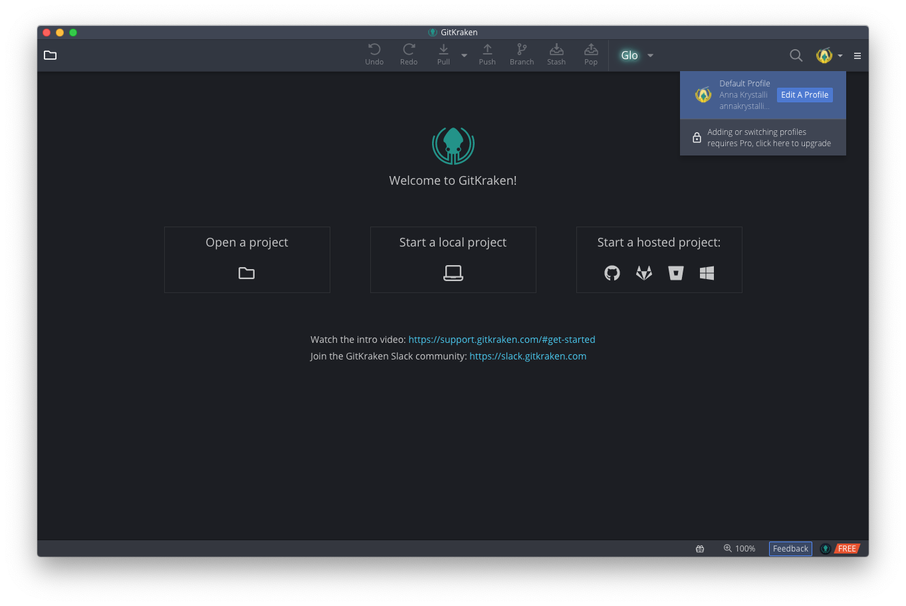

Next complete the details with the **username and email you used to sign up to GitHub** and save. Git has now been configured with these details.

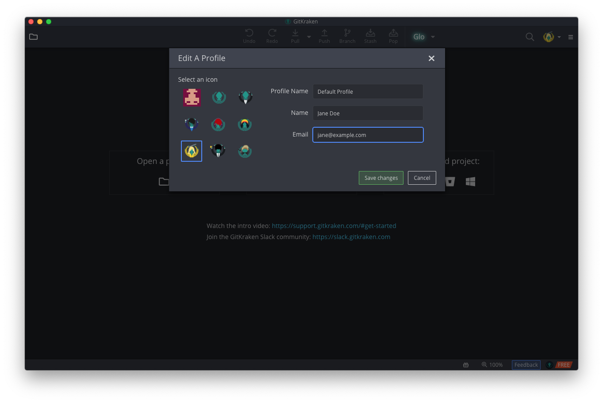

 

## Creating your first repository

When a local directory becomes **initialised with git**, a **hidden `.git` folder is added** to it. It's now called a **repository**. You can initialise an existing project with git or a start with a completely new project. We'll start by creating a new repository.

- In GitKraken, make sure you're logged in to GitHub.

- Create a new repository (`File > Init Repo`)

	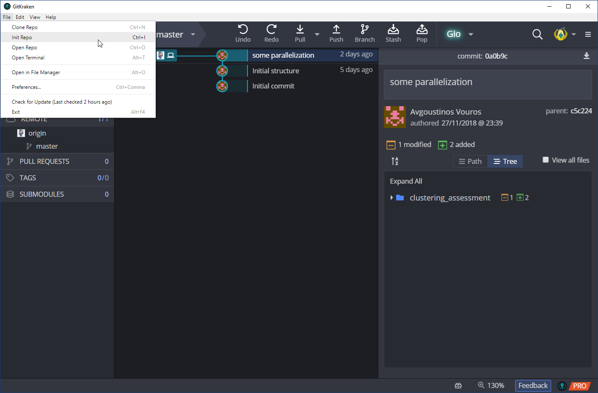

 

- You will be presented with a new GUI with a bunch of options. To initialise a new repository and create a linked GitHub repository in one step, choose the GitHub.com option.

	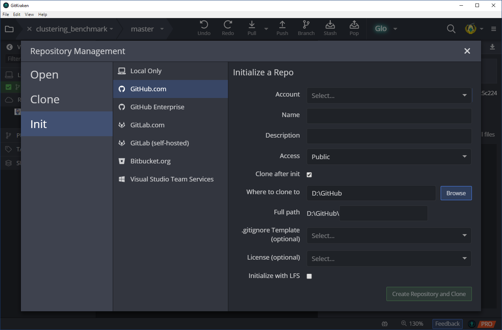
	
	- __Account:__ The account in which you want the repository to be created under. This can be your account or an organization that you have access to.

	- __Name:__  The name of the repository, let's say _git-lesson_.

	- __Description:__ Optional, but every repository should have a small description!

	- __Access:__ Public or Private.

	- __Clone after init:__ This checkbox tells GitKraken to clone the resulting GitHub repository. This essentially creates a local copy of the repository at the path you specify next.

	- __Where to clone to:__ Select the folder where the repository will be cloned to. Let's say _D:/GitHub_.

	- __Full path:__ This should now be _D:/GitHub/git-lesson_

	- __License:__ A license is mainly a list of permissions specifying how other people can use your code. For example you may want others to use your code but only if they accredited you. [choosealicense.com](https://choosealicense.com/) can help you choose the right license. For open source repositories MIT and GNU GPLv3 are usually appropriate licenses.

	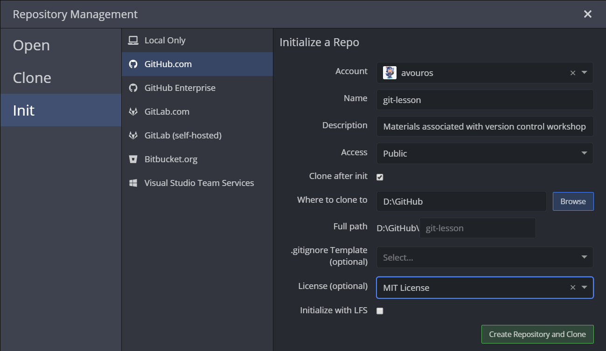

 

- Let's have a look at: 

	- the repository's history in GitKraken, 
	- our local version of the repository and 
	- the repository in GitHub.

	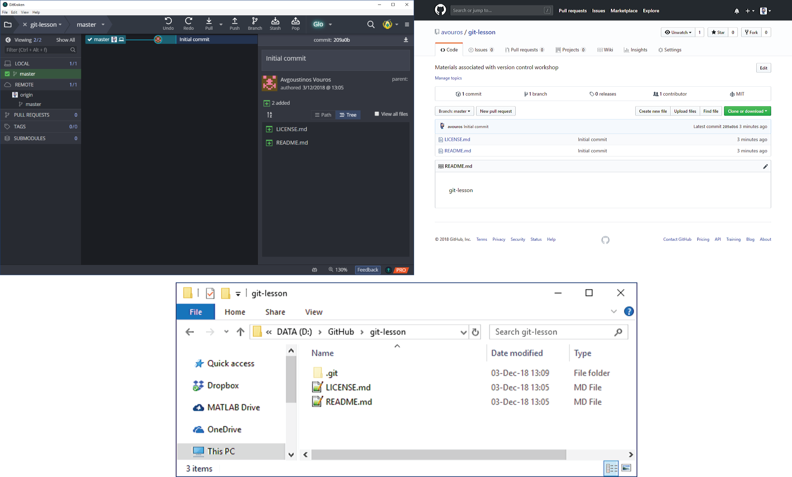

 

---

## Add a file to the repo

Okay! Now we need to do something with the repository. Let's start with a basic use-case and make a single file that lists some to-do items. The repository is just a normal folder on your computer where you can create and edit files like normal.

- Open the folder (repo) you have just created. In GitKraken, you can do this by going to `File > Open in File Manager`. 

	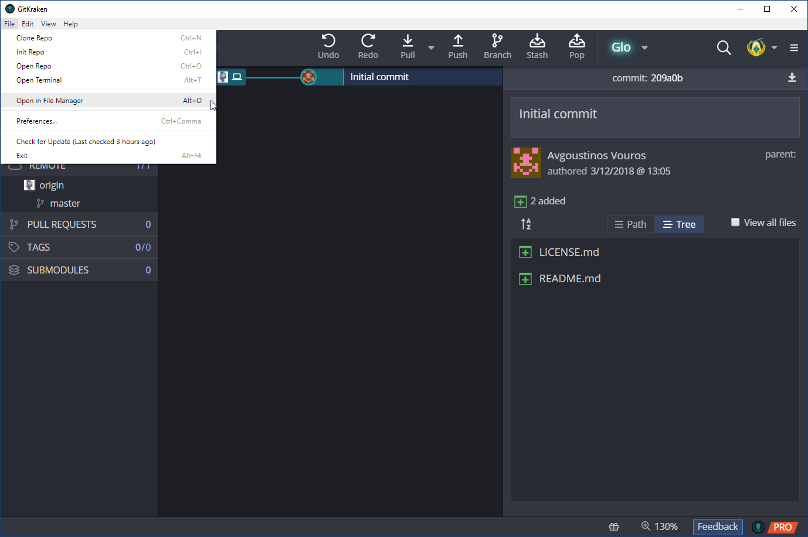

 

- Now create a file in this folder. Open your favourite text editor and use to create a new *TODO.txt* file.

	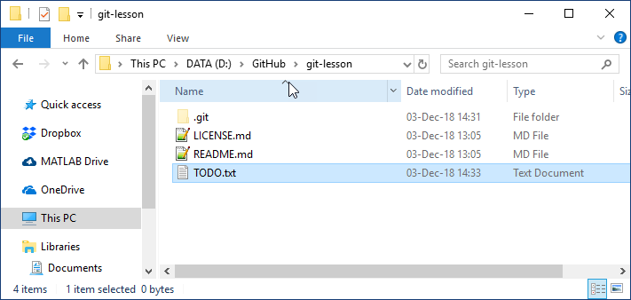

 

- Hop over to GitKraken again. You should see the new file you added! 

	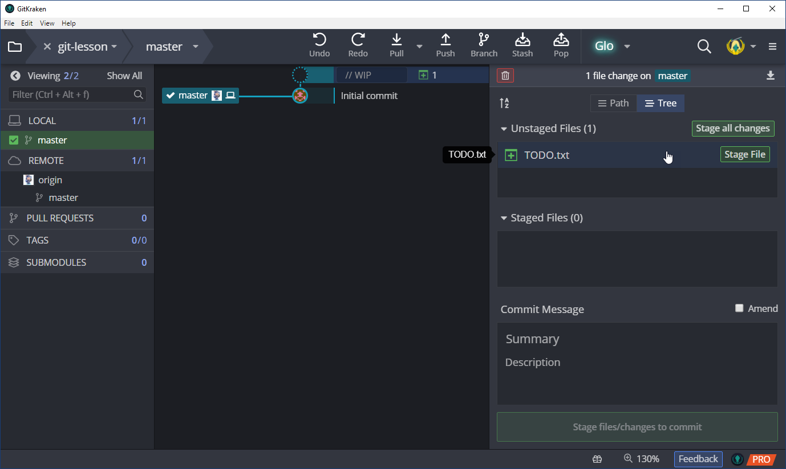

 

- Now it's time to **commit** you work. This is creating a *save point* you can come back to at any time. Aim to do this whenever you've done a small, complete chunk of work. GitKraken provides an easy to use interface for this job:

    - __Unstaged Files:__ Here you have a view of all the local changes of your repository. You can also see the changes done to each file by just clicking on it. You have the option to **stage** all the changes or some of them. Staging is essentially a commit preparation process.
    
    - __Staged Files:__ All files or folders which are selected to be committed will be moved in this area.
    
    - __Commit Message:__ Commit creates a save point and every save point should have a title as well as a small description so we know what was done and why. Remember some projects last for years and many other projects will spawn in the meantime. So when we revisit an old  repository or we want to go back in time to find a specific change we should be able to do that with minimum effort!
    
    - __Commit changes to n files:__ Pressing this button will commit our changes *to our local repository*.

	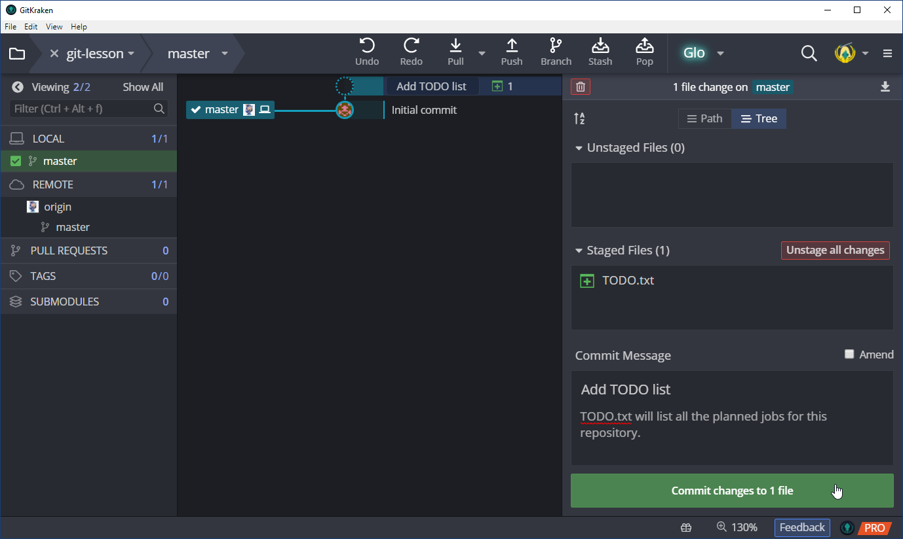
 

- 	Now that we have commited our changes locally we can **push** them up to the remote repository. This is done by pressing the **Push** button on the top of GitKraken navigation bar.

	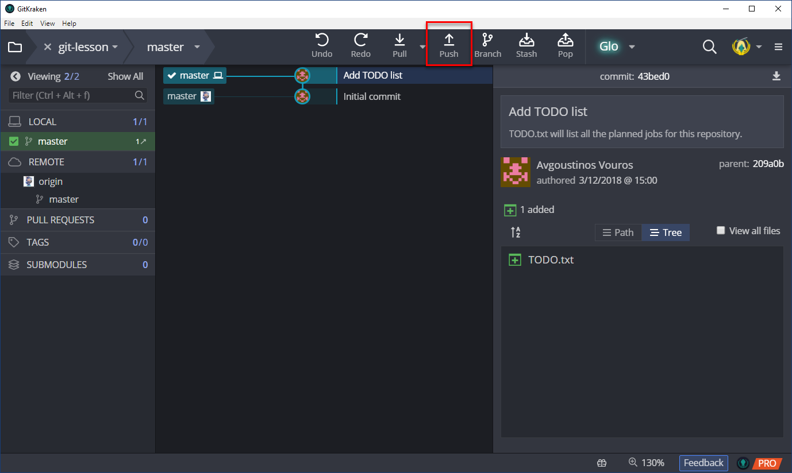	

 

---

## Check out the Git history

Now, if you look at the history of the repository you can see two commits. The first was automatically done by GitKraken when you created the repository - and the second should be yours!

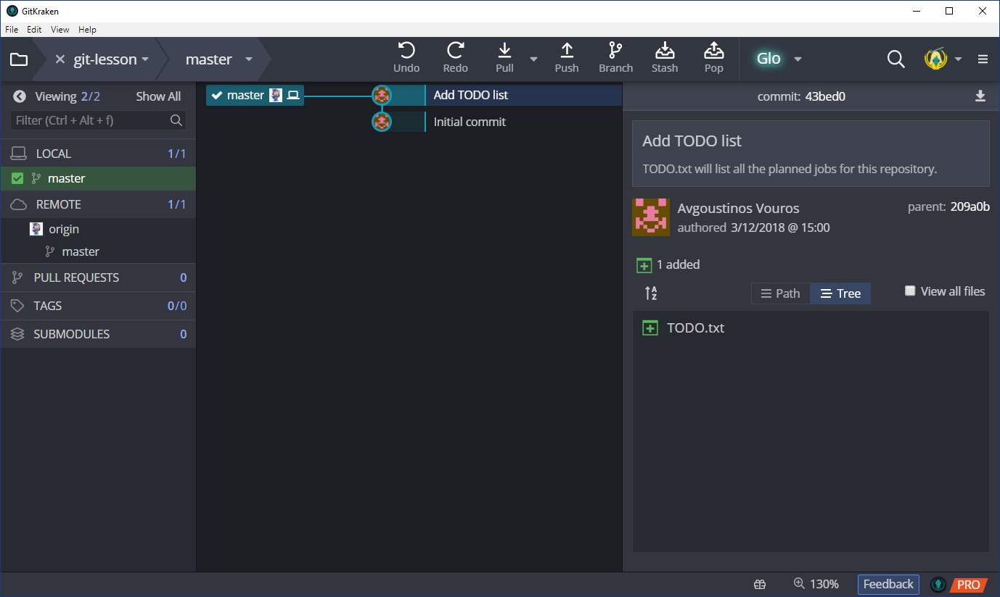	

 

---

## Make some more changes

- We've gotten some work done, so we'd like to update our to-do list:
    - Update the list with all the tasks we have completed.
    - Add any pending tasks

- Commit and push the changes in the TODO.txt. *Don't forget to type a summary message* before you commit!

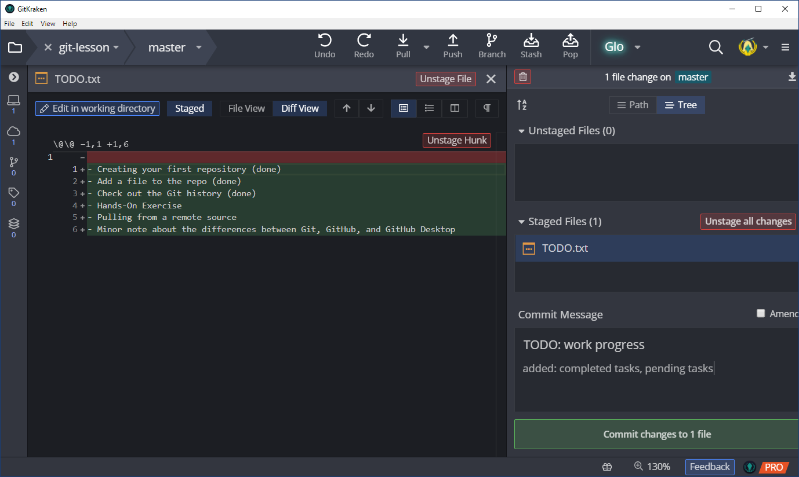	

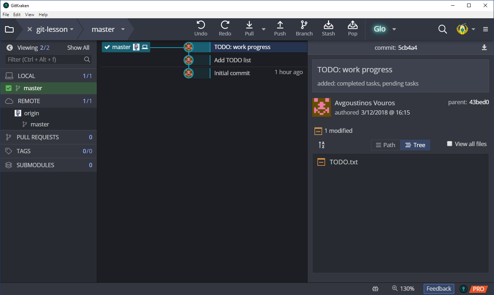	

 

---

## Pulling from a remote repository

**Push** makes sure that your work is not only in your computer but "online" as well which means:

  - It is backed up.
  - You can access it from any location.
  - If your repository is open, other people can benefit from your work, they can contribute, reference you or even make recommendations.
  
Now, what if you you make changes directly on the GitHub repository or using another machine ? These changes are not locally synchronized with your primary computer. This is where **pull** comes into play.  

 

- Navigate to your repository in GitHub and scroll down to *README.md*. GitHub automatically uses this file as a landing page to a repository which at the moment should be a mere *git-lesson*. To edit this file click on the small pencil icon. This icon is available for any file if you click on it but specifically for `README.md` it's also available as soon as you enter your repository.

	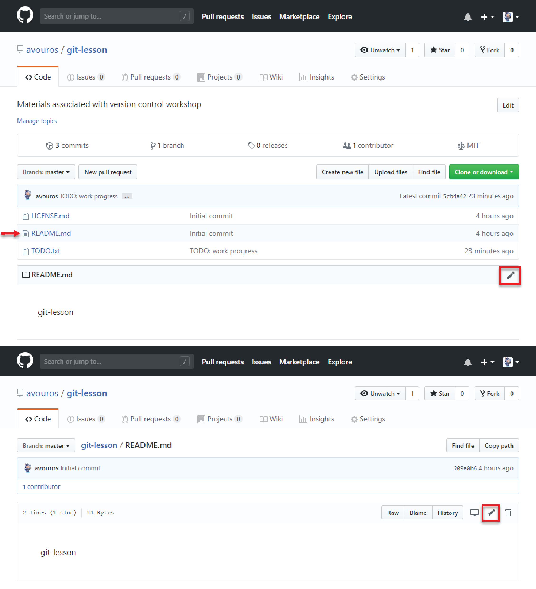	

 

- Now let's add some text, *Markdown* text (more on markdown [later](https://annakrystalli.me/open-source-workshop/practicalexercises/github/git-02-websites-with-github-pages)).

	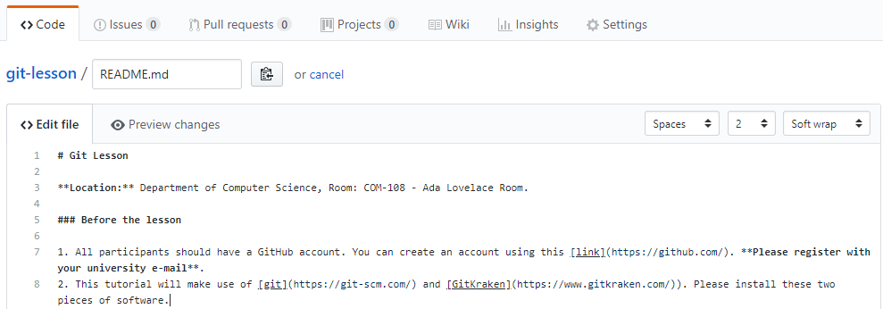
 

- Let's see how our Markdown code is rendered and check for typos in the text. If we are happy we can commit the changes. Since we are working online on GitHub there is no **push**.

	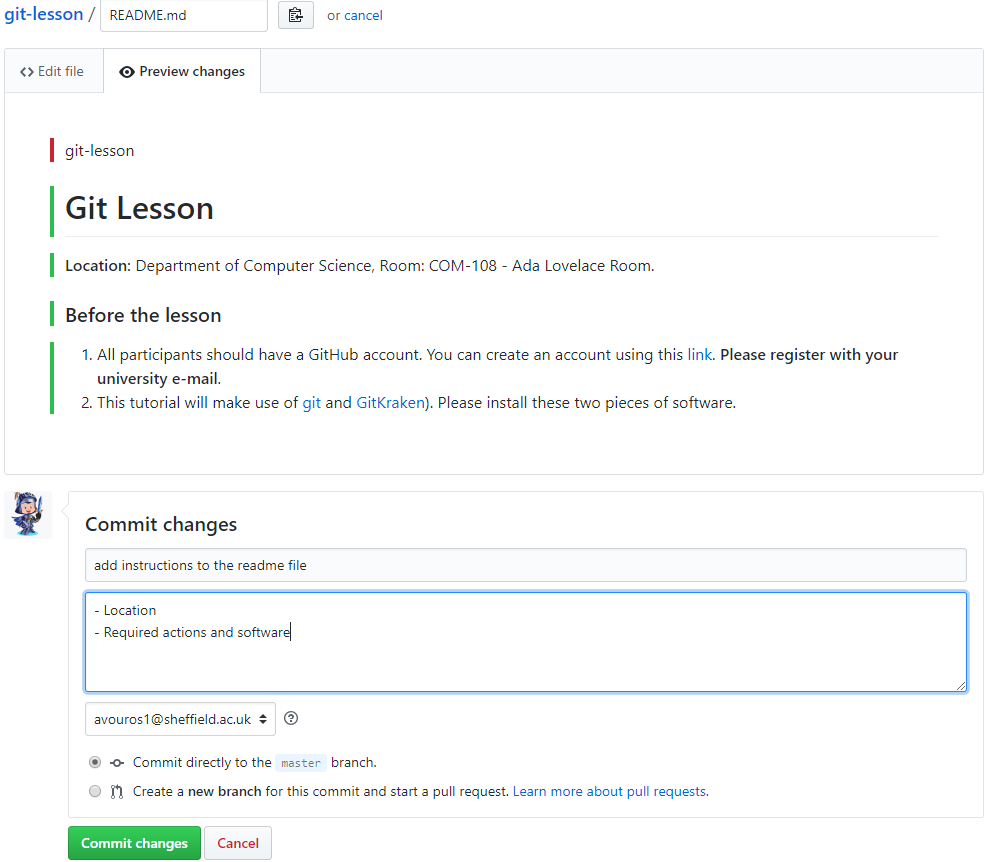

 

- Now back in GitKraken, we see that our remote repository is ahead of our local. We can also see that it is the local README.md file that is out of date. In order to synchronize the local with the remote repository we can use **Pull**. This will "download" any updates from the remote repository to our local one.

	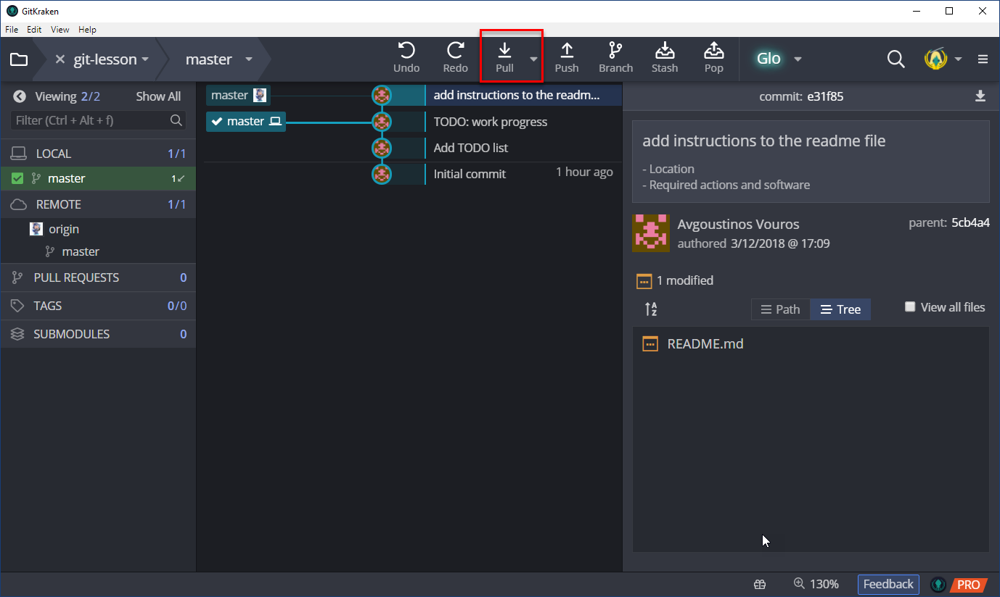

 

- Let's seen what happened after pulling the remote repository.

	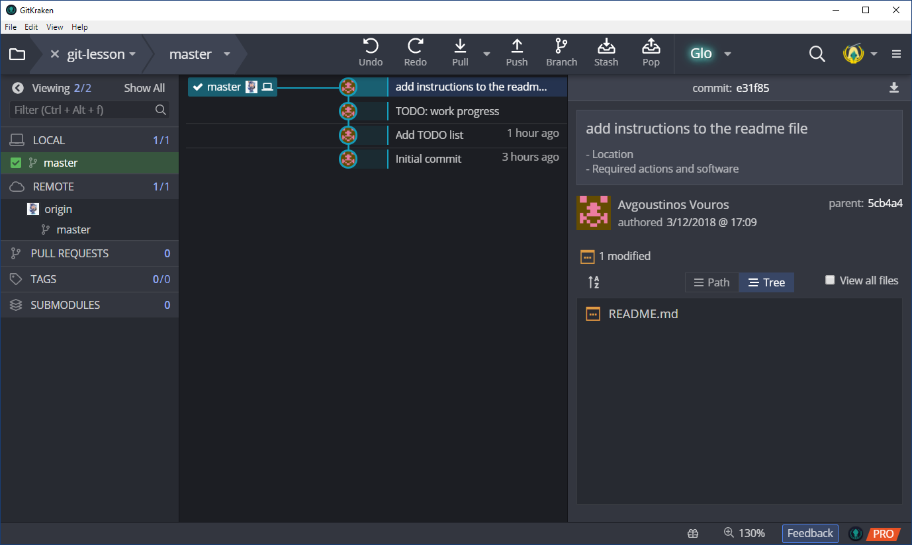

 

---

### `Git` tips

1. commit early, commit often
2. commit logical bits of work together
3. write meaninful messages

[[<<PREVIOUS: What is version control]](../../02-what-is-version-control) -
[[Table of Contents]](../../index) - [[NEXT: Cloning and collaborating: contributing changes>>]](git-03-cloning-and-collaborating)
