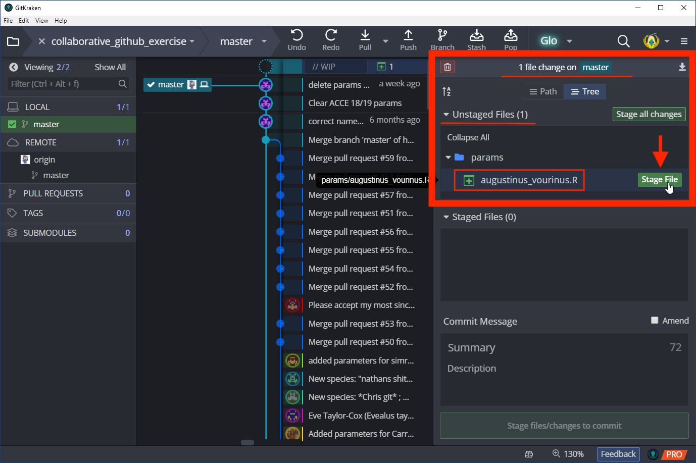
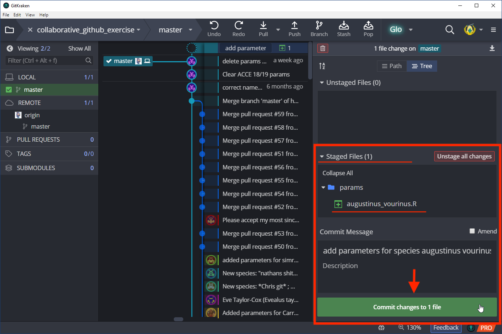
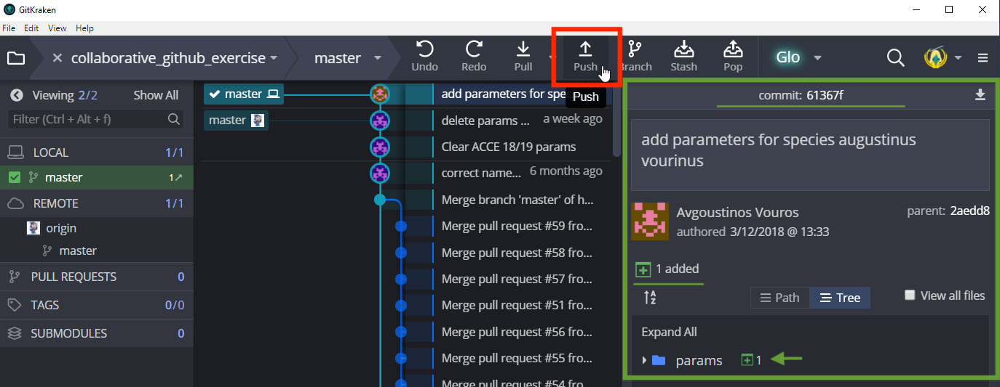
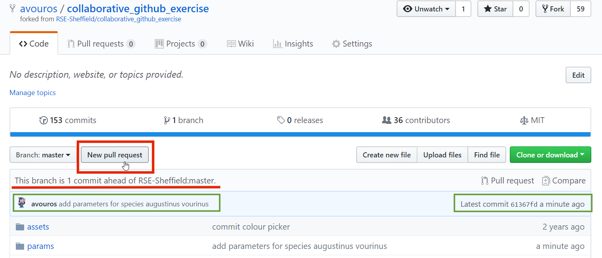
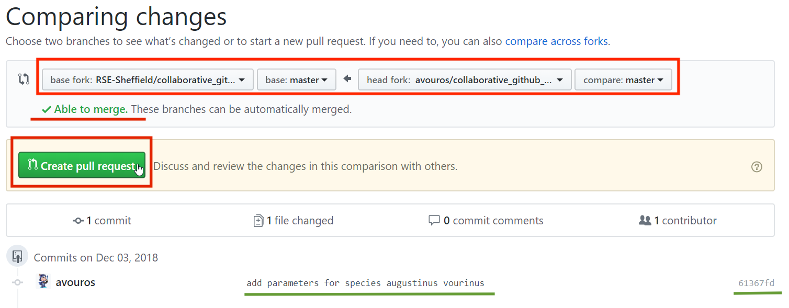

# Cloning and collaborating: contributing changes

[[<<PREVIOUS: Websites with GitHub pages>>]](git-02-websites-with-github-pages.md) -
[[Table of Contents]](../../index) - [[NEXT: Cloning and collaborating: managing contributions>>]](git-04-more-cloning-and-collaborating.md)

So far, we've learnt how to create repositories, commit files, and push/pull the files to a remote source like GitHub. Here we'll practice collaborating with someone else. There are two approaches to collaborating on GitHub:

## 1. Forking, cloning, and pull requests

If your code is online on GitHub and has an open licence, anyone can [fork](https://help.github.com/articles/fork-a-repo/) (make a separate copy of) your repository and work on it. 

Let's explore forking and cloning a GitHub repository through a fun exercise.

 

###  **EvoLottery: Welcome to the evolutionary lottery of skull and beak morphology**

> **Beak and skull shapes in birds of prey (“raptors”) are strongly coupled and largely controlled by size.** 

#### Exercise aims

- In this exercise, each participant will **fork a GitHub repository**, and **contribute a file** required to simulate the *evolutionary trajectory of an imaginary species' body size*.

We'll merge all contributions and [plot them together at the end!](http://rpubs.com/annakrystalli/278074) 

- We'll use **GitHub to collate all species files** and **plot** them all up together at the end! We'll also **discover the skull and beak shapes** associated with each simulated species size.

 

---

### **Fork a repository on GitHub** 

 

#### **Navigate to the repository**

<https://GitHub.com/RSE-Sheffield/collaborative_GitHub_exercise>

 

##### **Fork the repository**

Make your **own copy of the repository** on GitHub. Forks are linked and traceable

 

 

When forking, GitHub makes a **copy of the repository into your account**

 

 

### **Clone a repository using GitKraken** 

 

#### **Clone your fork**

 

Now that you have a fork in your account, let's clone it (ie download a local copy) through GitKraken.

To start clonining, go to: `File > Clone Repo`

 

In the **Clone** panel, select **GitHub.com** from the source panel. The right-side panel allows you to define the final details of the clone:

- __Where to clone to:__ Select the folder where the repository will be cloned to. Let's say _D:/GitHub_.

- __Repository to clone:__ Here you'll see a list of all the repositories you have access to and which you can clone. Choose the repository named _collaborative-github-exercise_.

- __Full path:__ Here GitKraken will show the full path where the repository will be cloned to. This will be _D:/GitHub/collaborative-github-exercise_.

 

When you're done specifying what and where to clone, click on **Clone the repo!**. If everything worked, you should see the following screen:

 

Click on open **Open Now** to view the version control activity associated with the project you just cloned. Git has been tracking the full history of the cloned repo, including all the changes made and who they were made by. 

 

The cloned repository contents should look like so:

 

---

### **Make a change to the repository**

For this exercise each participant will create a single new file, setting a few parameters to values of their choice, in their fork. We will then collate everyone's files in the original repository through **pull requests**.

The **`params/` folder is where we are going to gather our individual parameter files**. Currently, it just contains a **`.R` template file called `params_tmpl.R`**. Please **DO NOT EDIT this file**. We will **make a copy** of this file to edit. Let's go ahead and create and complete these files:
 
 
 
 

#### Make a copy of **`params/params_tmpl.R`**

First think of a species name based on your name, eg _Augustinus vourinous_. This will be the species name associated with the evolutionary trajectory defined by the parameters you're going to supply. This is both for for fun, but also to ensure that the files each participant commits has a unique name.

Now, make a copy of the file and save it in the same folder (`params/`). Use the species name you came up with to name the file.

 

#### Edit your parameters file with values of your choice 

Open the file you just created in your favourite text editor, edit it with parameters of your choice and save.

The parameters each participants need to supply are:

- **`sig2`:** A numeric value greater than 0 but smaller than 5

- **`species.name`:** a character string e.g. `"anas_krystallinus"`. Try to create a species name out of your name! It must be enclosed in double quotes (ie `"..."`)

- **`color`:**  a character string e.g. `"red"`, `"#FFFFFF"` (Check out the list of available [**colours in R**](http://www.stat.columbia.edu/~tzheng/files/Rcolor.pdf)). It also must be enclosed in double quotes (ie `"..."`)

**NB: remember to save the changes to your file**

 

---

### Commit changes locally to git

#### In GitKraken, stage the new file you created

Moving back to GitKraken you should now see that there is one file containing changes and that it is the new parameters file you just created.

To **add (stage) this file to the commit** we are about to make, click on the **Stage File** button next to the name of the file. Please **ONLY STAGE YOUR NEW FILE** (ie if for any reason you've accidentally edited any other file in the repo, please do not stage it).

 

#### Commit the staged file

The file has now moved to staging area. Were now ready to commit it. Before that we need to provide a **descriptive commit message** that explains what the changes contained in this commit are.

Once you've written an appropriate commit message, you can go ahead and click on **Commit changes** button to commit the file.

The changes have now been committed locally to git but you still need to update your remote fork on GitHub. We'll do this by pushing our local changes to GitHub

 

---

### Push changes to your fork GitHub

Now that you have made the commit, you now see the details of that commit in the right hand panel. To push the commit to your fork on GitHub, click on the **Push ⇧** button. Your changes have now been updated in your GitHub repo!

 

---

### Make a pull request to the upstream repository

Tha changes you made locally have now been committed and pushed to your fork on GitHub. If you go to GitHub, you'll now be able to see the details of the last commit. However, we **want to collect all participants' files in the upstream repository** ie `RSE-Sheffield/collaborative_github_exercise`. So the next step is to **make a pull request** from your fork to the upstream repository. 

 

#### Initiate a new pull request

GitHub is already flagging the fact that your **fork is ahead of the `master` branch** in the upstream repository and a **button to make a new pull request** with your changes is visible above that flag.

To initiate a pull request (PR) just **click that `New Pull Request` button**. 

 

#### Check that changes can be merged

Once a PR is initiated, GitHub automatically compares your version of the code to that in the upstream repository and checks whether your changes can be merged automatically, ie that they do not create any [merge conflicts](https://help.github.com/articles/about-merge-conflicts/). 

If everything has gone well, GitHub should advise that you are able to merge your changes. To continue, click on the **Create pull request** button.

 

#### Create pull request

You are finally ready to send the pull request to the upstream repo. The pull request not only shows the changes you made but also **initiates a comment thread in which you can communicate with the upstream repository owners**.

At this stage, you have the opportunity to give a bit more detail about the changes you have made. Be polite and friendly and be as descriptive as possible! Remember, **there are actual humans at the other end of the PR** that need to understand what changes you have made, why and be convinced that your changes are worth merging in to the code base.

 

---

### Response from the upstream repo owners

Once a PR is made, it isn’t automatically accepted. The repository owner doesn’t have to accept it, and they might even ask for changes or refuse it outright if the pull request has errors or doesn’t suit them for some reason. The owner of the upstream repository now has the opportunity to digest your pull request through a variety of tools. 

 

#### facility to inspect changes

For starters they have the opportunity to **inspect the changes** you have made to the code by clicking on the PR **files changed tab**. In this case they can clearly see that a whole new file was added. They can also check that the changes won't break the existing code. In this case they might check that the parameters submitted follow the guidelines set out in the exercise, ie that colour is a character vector enclosed in `"..."`. This testing process is what continuous integration systems are designed to automate.

 

#### facility to to respond to suggested changes

They also have an opportunity to discuss your changes in the **conversation tab**. Perhaps they are unclear about something or maybe they spotted something that needs changing. 

More often than not, you'll get a big THANK YOU! for your contribution and maybe even a :raised_hand: emoji!

 

#### merge your changes

Once they are happy with your changes they can go ahead an merge them by clicking on the **Merge pull request** button.

This creates a new commit in the upstream repository, documenting the merge of your changes into thhe upstream code base.

 

---

### Inspect your changes in the upstream repository 

You can now check the upstream repository to see **your merged changes**. The root of the repository indicates that the last commit was the merge of your pull request into the master branch:

Navigating to the `params/` folder, you should now see the params file you created with your original commit associated with it!

 

---

#´## Exercise recap:

- **fork the repo**: <https://GitHub.com/RSE-Sheffield/collaborative_GitHub_exer
- **create a new params** `.R` script. Name it using your selected species name.
- **enter parameters** for your species.
- **commit & push** your changes
- **create a pull request** to the upstream repo

We'll merge all contributions and [plot them together at the end!](http://rpubs.com/annakrystalli/278074) 

Last tip: You can actually [make pull requests in GitKraken](https://support.gitkraken.com/working-with-repositories/pull-requests)!

***

### The other way to collaborate - give someone repository access rights!

If you are working in a team with others you trust, you can edit repository settings so everyone who is working on the code can make commits directly to the same repository. Sometimes people will do this for small fixes, typos, etc. but still make pull requests for bigger changes - this allows collaborators to review your code before it's merged into the main codebase, ensuring it has enough documentation and test it for bugs.

To add a collaborator to your repository, in your GitHub repository online, go to the settings tab (top leftish), then click on the "Collaborators and teams" link on the left. 

[[<<PREVIOUS: Websites with GitHub pages>>]](git-02-websites-with-github-pages.md) -
[[Table of Contents]](../../index) - [[NEXT: Cloning and collaborating: managing contributions>>]](git-04-more-cloning-and-collaborating.md)
